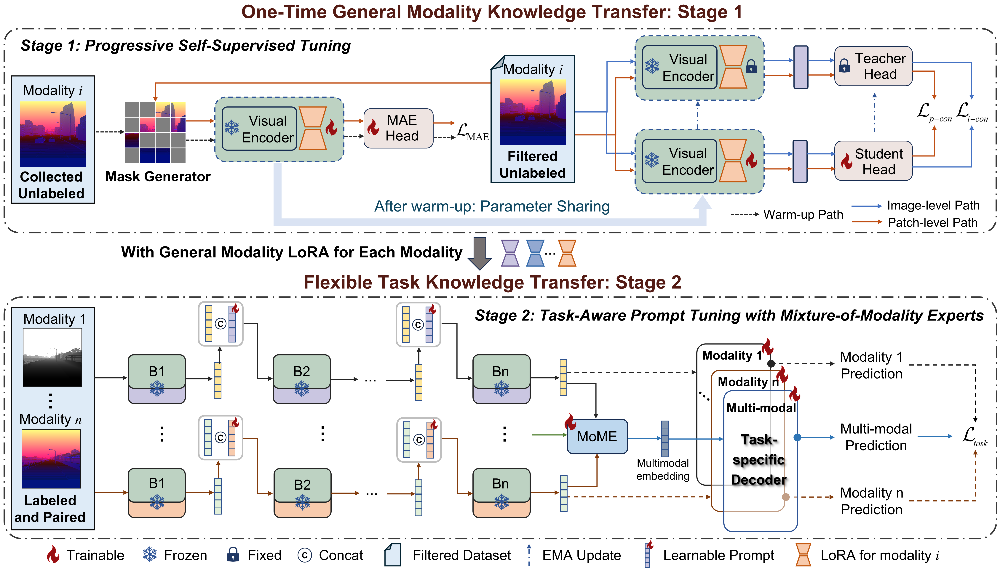

<div align="center">

# Decoupled and Reusable Adaptation for Efficient Cross-Modal Transfer

**[CVPR 2026]**

Yajing Liu · Yumeng Zhang · Yue Si · Baojie Fan · Jiandong Tian†
</div>

---

## 📌 Abstract

> Cross-modal transfer methods have achieved significant progress in extending RGB-based foundation models to non-RGB modalities. However, existing transfer paradigms are primarily task-oriented, meaning that changing tasks requires re-training and re-storing, leading to substantial redundancy in data, computation and storage. To address this limitation, we propose an efficient cross-modal trans fer paradigm that decouples the process into a one-time
general modality knowledge transfer and a flexible task knowledge transfer. In Stage 1, we propose a Progressive Self-Supervised Tuning strategy that integrates modality aware structural reconstruction with semantic discriminative learning, which enables task-agnostic modality knowl edge learning using only unlabeled data through a one-time training process, resulting in reusable target-modality LoRAs. In Stage 2, we incorporate the modality LoRAs and further propose a Task-Prompted Mixture-of-Modality Experts module. This design enables lightweight task knowledge injection while effectively balancing task-specific, modality-general and modality-specific knowledge in multimodal fusion process for diverse downstream tasks. Extensive experiments across six cross-modal transfer scenarios, along with analyses of data, computation, and storage
efficiency, demonstrate the superiority of our method.

<div align="center">
  
  <p><em>Figure 1：Framework Overview</em></p>
</div>

---


## 🛠️ Environment

```bash
# Clone the repo
git clone https://github.com/TooZE23/CMT.git
cd CMT

# Create conda environment
conda create -n cmt python=3.11 -y
conda activate cmt

# Install PyTorch
pip install torch==2.6.0 torchvision==0.21.0 --index-url https://download.pytorch.org/whl/cu124

# Install other dependencies
pip install -r requirements.txt
```

---

## 📦 Datasets
### PSST dataset
Will be released soon.

### Downstream dataset

| Dataset | Task | Num | Download |
|--------|------|----------|----------|
| MFNet | RGB-Thermal | 1569 | [Link](https://www.mi.t.u-tokyo.ac.jp/static/projects/mil_multispectral/) |
| PST900 | RGB-Thermal | 894 | [Link](https://drive.google.com/file/d/1hZeM-MvdUC_Btyok7mdF00RV-InbAadm/view?pli=1) |
| SUNRGBD | RGB-Depth | 10355 | [Link](https://rgbd.cs.princeton.edu/) |
| NYU Depthv2 | RGB-Depth | 1449 | [Link](https://cs.nyu.edu/~fergus/datasets/nyu_depth_v2.html) |
| MCubeS | RGB-Aolp-Dolp | 500 | [Link](https://github.com/kyotovision-public/multimodal-material-segmentation) |
| DELIVER | RGB-Depth-Event | 47310 | [Link](https://drive.google.com/file/d/1P-glCmr-iFSYrzCfNawgVI9qKWfP94pm/view) |

<!-- ### PSST预训练数据集 -->


---

<!-- ## 🏋️ 预训练权重

### 骨干网络预训练权重

| 骨干网络 | 预训练数据 | 下载 |
|----------|------------|------|
| ResNet-50 | ImageNet-1K | [链接](https://example.com) |
| ViT-B/16  | ImageNet-21K | [链接](https://example.com) |
| Swin-L    | ImageNet-22K | [链接](https://example.com) |

### 本文模型权重

| 模型 | 数据集 | Metric | 下载 |
|------|--------|--------|------|
| Ours-S | Dataset A | 82.3 | [Google Drive](https://drive.google.com) / [百度网盘](https://pan.baidu.com) |
| Ours-B | Dataset A | 84.7 | [Google Drive](https://drive.google.com) / [百度网盘](https://pan.baidu.com) |
| Ours-L | Dataset B | 56.2 mAP | [Google Drive](https://drive.google.com) / [百度网盘](https://pan.baidu.com) |

将下载的权重放置于 `checkpoints/` 目录下：

```
checkpoints/
├── backbone/
│   └── swin_large_patch4_window12_384_22k.pth
└── pretrained/
    ├── ours_small.pth
    ├── ours_base.pth
    └── ours_large.pth
``` -->

---

## 🚀 Train
### Single GPU
```bash
# 1. PSST warm-up stage, obtain an initial target-modality LoRA.
python 1_PSST_warm.py --config configs\PSST_warm.yaml
# 2. Continue training the modality LoRA to obtain the trained target-modality LoRA.
python 2_PSST_train.py --config configs\PSST_train.yaml
# 3. Equip the target-modality LoRA and freeze it, then train on downstream tasks.
python 3_TPMoME_train.py --config configs\mcubes_rgbad_sam2.yaml
```
### DDP
```bash
# 1. PSST warm-up stage, obtain an initial target-modality LoRA.
torchrun --nproc_per_node=4 1_PSST_warm.py --config configs\PSST_warm.yaml
# 2. Continue training the modality LoRA to obtain the trained target-modality LoRA.
torchrun --nproc_per_node=4 2_PSST_train.py --config configs\PSST_train.yaml
# 3. Equip the target-modality LoRA and freeze it, then train on downstream tasks.
torchrun --nproc_per_node=4 3_TPMoME_train.py --config configs\mcubes_rgbad_sam2.yaml
```
---

## 🔍 Downstream Evaluation

```bash
python 3_TPMoME_train.py \
    --config configs\mcubes_rgbad_sam2.yaml \
    --eval-only \
    ----model-path checkpoints/pretrained/ours_base.pth
```
---

## 📝 Citation

If this work is helpful to you, please cite our paper.：

```bibtex
@InProceedings{Liu_2026_CVPR,
    author    = {Liu, Yajing and Zhang, Yumeng and Si, Yue and Fan, Baojie and Tian, Jiandong},
    title     = {Decoupled and Reusable Adaptation for Efficient Cross-Modal Transfer},
    booktitle = {Proceedings of the IEEE/CVF Conference on Computer Vision and Pattern Recognition (CVPR)},
    year      = {2026},
    pages     = {812-822}
}
```

---

## 🙏 Acknowledgement

The code is built upon the following excellent open-source projects, to which we would like to express our gratitude:

- [DELIVER](https://github.com/InSAI-Lab/DELIVER)
- [dino finetune](https://github.com/robvangastel/dinov3-finetune)
- [DINOv2](https://github.com/facebookresearch/dinov2)
- [SAM2](https://github.com/facebookresearch/sam2)


